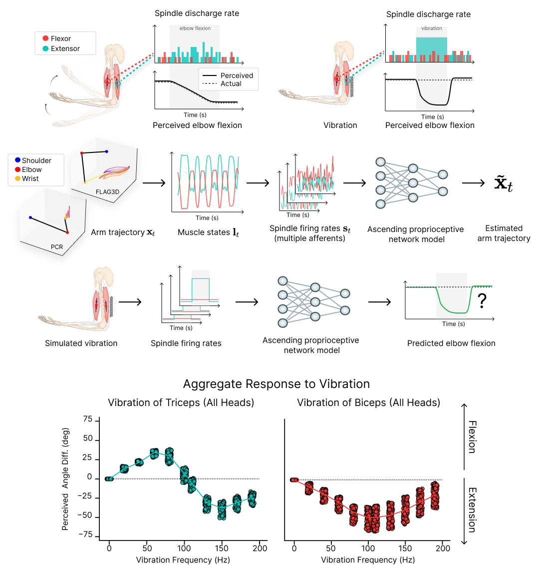

# Deep-learning models of the ascending proprioceptive pathway are subject to illusions

<p align="center">

</p>

## Authors
Adriana Perez Rotondo\*, Merkourios Simos\*, Florian David, Sebastian Pigeon, Olaf Blanke, & Alexander Mathis

\*These authors contributed equally to this work.

EPFL - École Polytechnique Fédérale de Lausanne, Switzerland 🇨🇭

## Overview
Proprioception is essential for perception and action. Like any other sense, proprioception is also subject to illusions. In this research, we model classic proprioceptive illusions in which tendon vibrations lead to biases in estimating the state of the body.

We investigate these illusions with task-driven models that have been trained to infer the state of the body from distributed sensory muscle spindle inputs (primary and secondary afferents). Recent work has shown that such models exhibit representations similar to the neural code along the ascending proprioceptive pathway.

Importantly, we did not train the models on illusion experiments and simulated muscle-tendon vibrations by considering their effect on primary afferents. Our results demonstrate that task-driven models are indeed susceptible to proprioceptive illusions, with the magnitude of the illusion depending on the vibration frequency. This work illustrates that primary afferents alone are sufficient to account for these classic illusions and provides a foundation for future theory-driven experiments.

The preprint is available on [bioRxiv](https://www.biorxiv.org/content/10.1101/2025.03.15.643457v1). 

> **Note:** The code and datasets will be available soon!

## Contributions

1. **Simulating Proprioceptive Illusions**: We modeled how tendon vibrations affect afferent signals and demonstrated that these altered inputs lead to illusory perceptions in deep learning models.

2. **Frequency-Dependent Illusion Profiles**: We showed that the strength of the illusion varies with vibration frequency, matching patterns observed in human psychophysics experiments.

3. **Role of Afferent Types**: Our research highlights distinct contributions of primary (type Ia) and secondary (type II) afferents to proprioceptive illusions.

4. **Muscle-Specific Effects**: We systematically investigated the effects of vibrating each of the 25 modeled muscles, revealing functional relationships between specific muscles and elbow angle perception.

5. **Mechanism Insights**: We established a direct link between peripheral physiological properties of muscle spindles and central perceptual illusions.

## Installation

Instructions for installation will be provided once the code is released.

## Usage

Example usage scripts will be available with the code release.

## Citation

If you find this work useful in your research, please consider citing our paper:

```bibtex
@article{perezrotondo2025illusions,
  title={Deep-learning models of the ascending proprioceptive pathway are subject to illusions},
  author={Perez Rotondo, Adriana and Simos, Merkourios and David, Florian and Pigeon, Sebastian and Blanke, Olaf and Mathis, Alexander},
  journal={bioRxiv},
  year={2025},
  doi={10.1101/2025.03.15.643457}
}
```

## Acknowledgements

This code for this project is partly based on two previous works in the lab: [DeepDraw](https://github.com/amathislab/DeepDraw), and [Task-driven-Proprioception](https://github.com/amathislab/Task-driven-Proprioception). We thank the authors of these works for their contributions, and we encourage you to check them out!

We thank Alberto Chiappa and Andy Bonnetto for their helpful technical input. We thank Michael Dimitriou, Anne Kavounoudias, Bianca Ziliotto and Alessandro Marin Vargas for discussions.

This project is funded by Swiss SNF grant (310030_212516), and EPFL's Excellence Research Internship Program and University of Toronto's ESROP-ExOp for S.P.

## License

This project is licensed under the [CC-BY-NC 4.0 International license](https://creativecommons.org/licenses/by-nc/4.0/).
